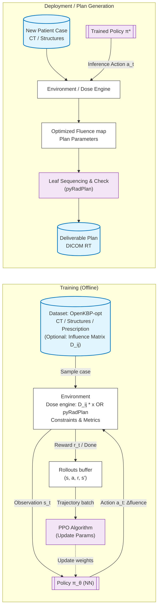

```mermaid
flowchart LR
    %% 定义样式类，让配色更专业
    classDef plain fill:#fff,stroke:#333,stroke-width:1px;
    classDef database fill:#e1f5fe,stroke:#0277bd,stroke-width:2px;
    classDef process fill:#f3e5f5,stroke:#7b1fa2,stroke-width:1px;

    subgraph Train["Training (Offline)"]
        direction TB
        D[("Dataset: OpenKBP-opt\nCT / Structures / Prescription\n(Optional: Influence Matrix D_ij)")]:::database
        
        E["Environment\nDose engine: D_ij * x OR pyRadPlan\nConstraints & Metrics"]:::plain
        
        P[["Policy π_θ (NN)"]]:::process
        R["Rollouts buffer\n(s, a, r, s')"]:::plain
        Algo["PPO Algorithm\n(Update Params)"]:::process

        %% 训练循环逻辑
        D -->|Sample case| E
        E -->|Observation s_t| P
        P -->|Action a_t: Δfluence| E
        E -->|Reward r_t / Done| R
        R -->|Trajectory batch| Algo
        Algo -.->|Update weights| P
    end

    subgraph Deploy["Deployment / Plan Generation"]
        direction TB
        N[("New Patient Case\nCT / Structures")]:::database
        E2["Environment / Dose Engine"]:::plain
        P_Trained[["Trained Policy π*"]]:::process
        
        Opt_F["Optimized Fluence map\nPlan Parameters"]:::plain
        Seq["Leaf Sequencing & Check\n(pyRadPlan)"]:::process
        Final[("Deliverable Plan\nDICOM RT")]:::database

        %% 推理逻辑
        N --> E2
        P_Trained -->|Inference Action a_t| E2
        E2 --> Opt_F
        Opt_F --> Seq
        Seq --> Final
    end

    %% 设置连接线样式
    linkStyle default stroke:#333,stroke-width:1px;
```